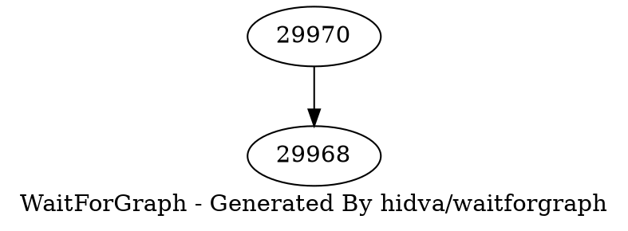

A utility used for generating locks wait-for graph for Greenplum Database

```bash
# Use PG* environment variables (PGDATABASE, PGUSER, ...) as connection information by default
waitforgraph > wfg.dot
dot -T svg < wfg.dot > wfg.svg
# also support Connection String described in https://www.postgresql.org/docs/current/libpq-connect.html
waitforgraph dbname=DATABASENAME | dot -T svg > wfg.svg
open wfg.svg
```

The locks wait-for graph looks as follow:


There is more detailed information in the dot file:


